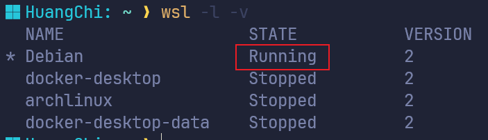
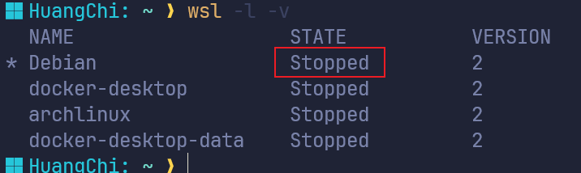
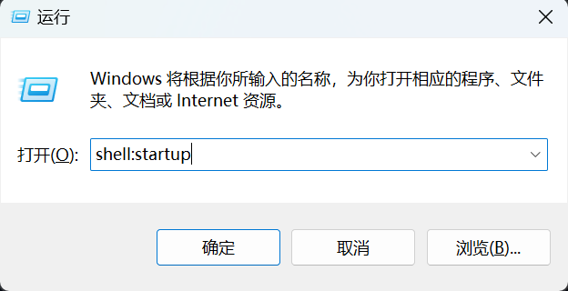
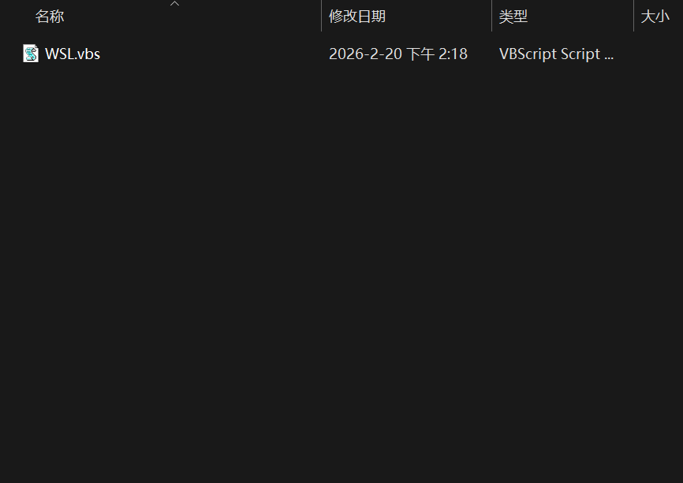

[WSL官方文档](https://learn.microsoft.com/zh-cn/windows/wsl/)

## 1. WSL安装

```powershell
# 更新
wsl --update
# 查看可以安装的Linux发行版
wsl -l -o(wsl --list --online)
# 暗转Linux
wsl --install -d <Linux发行版名称>
# 不指定则默认安装Ubuntu
wsl --install
# 安装Debian(也可以是别的发行版)
wsl --install -d Debian 
# 验证安装
wsl -l -v(wsl --list --verbose)
# 切换默认发行版
wsl --set-default archlinux
wsl --set-default Debian
```

## 2. 迁移/备份(⭐推荐)
WSL默认安装路径不方便查找和管理，因此推荐迁移到指定位置，比如电脑做了磁盘分区，希望迁移到D盘，都可以进行此操作。

### 1. 导出前置条件
导出前需先确保对应发行版处于关闭状态，使用`wsl -l -v`查看状态，如果是`Running`则需要先关闭Linux子系统，使用`wsl --shutdown` 关闭WSL子系统(❗会关闭所有的发行版)

再次执行`wsl -l -v`确保已经关闭


### 2. 导出tar文件
```powershell
# 导出命令
wsl --export <Linux发行版名称> <导出文件的绝对路径.tar>
# 执行导出
wsl --export Debian C:\Users\HuangChi\Desktop\debian.tar
```

### 3. 卸载当前Linux发行版
导入前需要先取消注册发行版(❗会丢失当前发行版的数据)
```powershell
# 取消注册发行版
wsl --unregister <Linux发行版名称>
wsl --unregister Debian
```

### 4. 导入
```powershell
# 导入命令
wsl --import <Linux发行版名称> <导入Linux存储的路径(文件夹)> <导出文件的绝对路径(文件)>
# 执行导入
wsl --import Debian C:\Software\Linux\Debian C:\Users\HuangChi\Desktop\debian.tar --version 2
```

### 5. 默认值设置
```powershell
# 重新设置默认发行版(只有一个发行版则直接为默认)
wsl --set-default <Linux发行版名称>
wsl --set-default Debian

# 设置 Linux 发行版的默认用户
<Linux发行版名称> config --default-user <用户名>
Debian config --default-user root
```

## 3. 设置开机自启
> WSL 默认不会随 Windows 启动，如果 WSL 服务可以随 Windows 系统启动，这将对在 WSL 下搭建的自启服务或者环境很有用。

### 1. 打开Windows启动菜单
快捷键 `win` + `R` 打开运行窗口，输入 `shell:startup` 然后确定。

会跳转至 `Windows` 启动菜单目录

### 2. 创建自启脚本
新建文本文档，将如下命令复制进去，文件名称可以自定义，然后另存为 `.vbs` 格式，自启文件就配置好了，之后 `WSL` 服务就会随着 `Windows` 自启了。

```vbs
Set ws = WScript.CreateObject("WScript.Shell")
ws.run "wsl",vbhide
```
